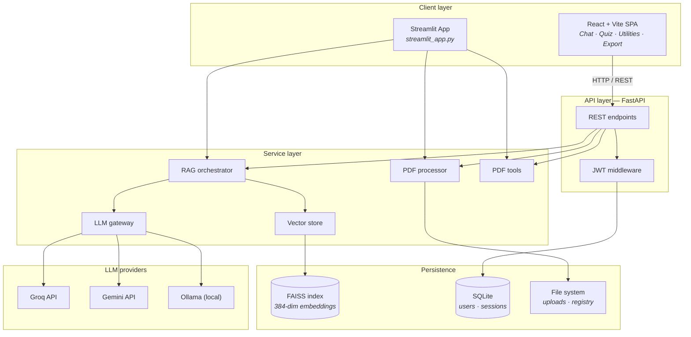

<div align="center">

# DocuFusion AI

### Enterprise-grade AI document intelligence & PDF utility platform

Transform static PDFs into an intelligent, searchable, and interactive knowledge system powered by **Retrieval-Augmented Generation (RAG)**.

Upload documents · Ask contextual questions · Generate summaries · Create quizzes · Run advanced PDF operations — from one unified AI workspace.

[](https://www.python.org/)
[](https://fastapi.tiangolo.com/)
[](https://react.dev/)
[](https://ai-pdf-assistant-alh24ogvrzn5mi9jcsz3eq.streamlit.app/)
[](https://github.com/facebookresearch/faiss)
[](LICENSE)

### Live demo

**[https://ai-pdf-assistant-alh24ogvrzn5mi9jcsz3eq.streamlit.app/](https://ai-pdf-assistant-alh24ogvrzn5mi9jcsz3eq.streamlit.app/)**

No installation required · upload a PDF in the **sidebar** → chat, summarize, quiz, or use utilities.

[Problem](#-problem-statement) · [Solution](#-solution-overview) · [Features](#-core-features) · [Architecture](#-system-architecture) · [Quick start](#-run-locally) · [Deploy](#-deployment)

</div>

---

## Problem statement

Modern users interact with massive volumes of PDF-based information daily:

- Research papers · academic notes · technical documentation  
- Reports · legal contracts · study material · manuals · resumes  

Traditional PDF readers are **static and inefficient**. Users often struggle to:

- Find relevant information quickly  
- Search **semantically** across multiple documents  
- Extract insights from long PDFs  
- **Verify** AI-generated answers  
- Work with **scanned** documents  
- Manage PDF workflows in one place  

Most AI chatbots suffer from a critical limitation:

> **They hallucinate** because they are not grounded in the user’s actual documents.

**DocuFusion AI** solves this with **Retrieval-Augmented Generation (RAG)** — retrieve relevant passages from uploaded PDFs first, then generate answers with **page-level citations**.

---

## Solution overview

**DocuFusion AI** is a full-stack document intelligence platform that combines:

| Layer | Capabilities |
|:------|:---------------|
| **Intelligence** | RAG chat · semantic search · summarization · quiz generation · compare mode |
| **Retrieval** | FAISS vector search · hybrid math retrieval · citation metadata |
| **Ingestion** | PyMuPDF extraction · optional Tesseract OCR |
| **Utilities** | Merge · split · compress · convert · encrypt · images → PDF |
| **Interfaces** | **Streamlit** (public demo) · **React + FastAPI** (full product) |
| **LLMs** | Groq · Gemini · Ollama (env-switchable) |

The platform turns PDFs into a **queryable knowledge base** instead of sending entire files blindly to an LLM.

---

## Key highlights

- Enterprise-style **RAG** architecture with grounded responses  
- **Multi-document** semantic retrieval and cross-PDF compare mode  
- **Citations** on every answer (`doc_id`, page, chunk, score)  
- **Hybrid retrieval** for math-heavy and formula queries  
- **FastAPI + React + Streamlit** — shared backend services, two deployment surfaces  
- **FAISS** vector index (`all-MiniLM-L6-v2`, 384-dim)  
- **JWT authentication** and SQLite chat history (full stack)  
- **OCR** fallback for scanned PDFs (local / full stack)  
- **PDF utility toolkit** (PyMuPDF)  
- **Voice input** and export (DOCX / PDF) on React + API  
- **Docker** and Streamlit Cloud deployment-ready  
- **Multi-LLM** gateway — no RAG code changes when switching providers  

---

## Why this project stands out

Most student AI projects are thin wrappers around LLM APIs. This repo implements patterns used in **production document systems**:

| Challenge | Solution implemented |
|:----------|:---------------------|
| LLM hallucinations | RAG pipeline with contextual retrieval |
| Poor PDF search | Semantic vector search with FAISS |
| Lack of transparency | Page-level citations |
| Scanned PDFs | OCR fallback (Tesseract) |
| Single-document limits | Multi-PDF selection + compare mode |
| Static workflows | Integrated PDF utility toolkit |
| Demo vs product | Streamlit share link + modular FastAPI backend |
| No deployment story | Streamlit Cloud + Docker Compose |

---

## Live demo

| | |
|---|---|
| **URL** | https://ai-pdf-assistant-alh24ogvrzn5mi9jcsz3eq.streamlit.app/ |
| **Entry file** | [`streamlit_app.py`](streamlit_app.py) |
| **Theme** | Dark (`.streamlit/config.toml`) |

### Available on Streamlit

- PDF upload & auto-indexing (sidebar)  
- AI-powered PDF chat with citations  
- Semantic / keyword search  
- AI summarization  
- Quiz generation  
- PDF merge · split · compress  
- Export (notes DOCX · report PDF)  

> **Full stack only:** JWT auth · persistent chat history · voice input (Groq Whisper).  
> Streamlit sessions on Cloud are **ephemeral** when the app sleeps.

---

## Core features

### AI document intelligence

| Feature | Description |
|:--------|:------------|
| **Multi-PDF upload** | Upload and analyze multiple PDFs (15 MB limit) |
| **AI chat** | Contextual Q&A scoped to selected documents |
| **Semantic search** | Meaning-based retrieval via embeddings |
| **AI summarization** | Short, detailed, or bullet summaries |
| **Quiz generation** | MCQs from document content |
| **Citation support** | Grounded answers with page references |
| **Compare mode** | Cross-document analysis (2+ PDFs) |
| **OCR support** | Text extraction from scanned PDFs (full stack) |

### PDF utility features

| Utility | Description |
|:--------|:------------|
| **Merge** | Combine multiple PDFs (upload or library) |
| **Split** | By page ranges (`1-3,5,7-10`) or per-page ZIP |
| **Compress** | Reduce file size |
| **Convert** | PDF → TXT or PNG (ZIP) |
| **Encrypt** | AES-256 password protection |
| **Images → PDF** | Assemble PNG/JPG into one document |

### Full stack features (React + FastAPI)

| Capability | Description |
|:-----------|:------------|
| **JWT authentication** | Register · login · protected routes |
| **Chat history** | Persistent sessions in SQLite |
| **Voice input** | Speech-to-text via Groq Whisper |
| **Export** | DOCX notes and PDF reports |
| **Docker** | `docker compose up --build` |
| **Streamlit demo** | Public browser deployment (shared services) |

| Capability | Streamlit | React + API |
|:-----------|:----------|:------------|
| Notes / report export | ✓ | ✓ |
| Voice input | — | ✓ |
| Persistent history | — | ✓ |
| Dark / light theme | Dark only | Both |

---

## System architecture

### Full-stack diagram



### End-to-end RAG flow

```text
                ┌──────────────────────┐
                │      User upload     │
                └──────────┬───────────┘
                           │
                           ▼
                ┌──────────────────────┐
                │   PDF processing     │
                │  Text + OCR extract  │
                └──────────┬───────────┘
                           │
                           ▼
                ┌──────────────────────┐
                │      Chunking        │
                │ Context segmentation │
                └──────────┬───────────┘
                           │
                           ▼
                ┌──────────────────────┐
                │     Embeddings       │
                │ Sentence Transformers│
                └──────────┬───────────┘
                           │
                           ▼
                ┌──────────────────────┐
                │   FAISS vector DB    │
                └──────────┬───────────┘
                           │
                           ▼
                ┌──────────────────────┐
                │ Semantic retrieval   │
                └──────────┬───────────┘
                           │
                           ▼
                ┌──────────────────────┐
                │      LLM layer       │
                │ Groq / Gemini / Local│
                └──────────┬───────────┘
                           │
                           ▼
                ┌──────────────────────┐
                │ AI response + source │
                │      citations       │
                └──────────────────────┘
```

### Ingestion pipeline

```text
 PDF upload
     │
     ▼
┌─────────────────┐
│ Text extraction │──► PyMuPDF (primary) ──► OCR fallback (Tesseract)
└────────┬────────┘
         ▼
┌─────────────────┐
│    Chunking     │──► 700-char windows · 120-char overlap · page metadata
└────────┬────────┘
         ▼
┌─────────────────┐
│   Embedding     │──► sentence-transformers/all-MiniLM-L6-v2 (384-dim)
└────────┬────────┘
         ▼
┌─────────────────┐
│  FAISS index    │──► IndexFlatIP · L2-normalized · cosine similarity
└─────────────────┘
```

### Query pipeline

```text
 User question
     │
     ├──► Math detected? ──► Hybrid retrieval (vector + keyword merge)
     │                       Top-K = 12 · stronger LLM · step-by-step prompt
     │
     └──► Standard query ──► Vector search only · Top-K = 5
              │
              ▼
     Context assembly with metadata headers
              │
              ▼
     LLM generation (Groq / Gemini / Ollama)
              │
              ▼
     Answer + citations[]
```

---

## Retrieval-Augmented Generation (RAG)

Instead of sending entire PDFs directly to an LLM:

1. PDFs are processed and **chunked**  
2. Chunks are converted into **embeddings**  
3. Embeddings are stored in **FAISS**  
4. User queries are **semantically matched**  
5. Relevant chunks are **retrieved**  
6. The LLM generates **grounded** responses  
7. **Citations** are attached to outputs  

This improves **accuracy**, **reliability**, **transparency**, **context retention**, and **scalability** versus raw prompt stuffing.

---

## Technical deep dive

### Vector search

Embeddings: **`sentence-transformers/all-MiniLM-L6-v2`**

- 384-dimensional vectors  
- **FAISS `IndexFlatIP`** with L2 normalization → cosine similarity via inner product  
- Low-latency local retrieval  
- Per-chunk provenance:

```python
ChunkMeta(doc_id: str, page: int, chunk_id: int, text: str)
```

### Hybrid retrieval for mathematical queries

For formula-heavy content (`is_math_question`):

1. **Expanded Top-K** — `MATH_TOP_K = 12` (vs `TOP_K = 5`)  
2. **Keyword augmentation** — `extract_math_terms()` merged with vector hits  
3. **Deduplication** — `_merge_hits()` ranks combined results  
4. **Model routing** — `llama-3.3-70b-versatile` with step-by-step math prompting  

### Multi-LLM support

| Provider | Usage | Default model |
|:---------|:------|:--------------|
| **Groq** | Fast primary inference | `llama-3.1-8b-instant` |
| **Groq** | Math / reasoning | `llama-3.3-70b-versatile` |
| **Gemini** | Cloud alternative | `gemini-2.0-flash` |
| **Ollama** | Local / offline | Configurable |

Set `LLM_PROVIDER` in environment — the RAG layer stays unchanged.

### Authentication (full stack)

- JWT tokens (`python-jose`, HS256)  
- Password hashing (`passlib`)  
- Chat sessions in **SQLite**  
- Axios Bearer interceptor on protected routes  

---

## Engineering skills demonstrated

- AI/ML engineering · **RAG** · semantic search  
- Vector databases (FAISS) · embedding pipelines  
- Full-stack development · **REST API** design  
- Authentication & authorization (JWT)  
- PDF processing · **OCR** systems  
- Docker & cloud deployment (Streamlit)  
- Modular service-oriented backend  
- Multi-LLM integration and provider abstraction  

---

## Tech stack

| Layer | Technology | Purpose |
|:------|:-----------|:--------|
| **Demo UI** | Streamlit | Public browser demo |
| **Product UI** | React 18, Vite 6, CSS variables | SPA with dark/light mode |
| **Backend** | FastAPI, Uvicorn | Async REST + OpenAPI |
| **Validation** | Pydantic v2 | Request/response schemas |
| **Embeddings** | Sentence Transformers | Local embedding generation |
| **Vector DB** | FAISS (CPU) | Similarity search |
| **LLM** | Groq, Gemini, Ollama | Multi-provider generation |
| **PDF** | PyMuPDF, pypdf | Extract, manipulate, encrypt |
| **OCR** | Tesseract, pdf2image | Scanned document recovery |
| **Auth** | python-jose, passlib | JWT + password hashing |
| **Database** | SQLite | Users, sessions, messages |
| **Export** | python-docx, ReportLab | DOCX and PDF export |
| **DevOps** | Docker, docker-compose | Containerized runs |

---

## Project structure

```text
AI-PDF-ASSISTANT/                    # GitHub repo name
│
├── backend/app/
│   ├── main.py                       # FastAPI entry + routers
│   ├── config.py                     # Settings from environment
│   ├── routes/
│   │   ├── upload.py                 # PDF upload & ingestion
│   │   ├── chat.py                   # RAG-based AI chat
│   │   ├── summary.py                # AI summarization
│   │   ├── search.py                 # Semantic / keyword search
│   │   ├── quiz.py                   # Quiz generation
│   │   ├── auth.py                   # Authentication
│   │   ├── history.py                # Chat session management
│   │   ├── export_voice.py           # Export + voice transcription
│   │   └── pdf_tools.py              # PDF utility endpoints
│   └── services/
│       ├── rag.py                    # RAG orchestration
│       ├── vector_store.py           # FAISS index
│       ├── llm.py                    # Multi-provider LLM gateway
│       ├── pdf_processor.py          # Extraction + OCR
│       ├── pdf_tools.py              # Merge, split, compress, …
│       └── math_utils.py             # Math detection + hybrid retrieval
│
├── frontend/src/
│   ├── App.jsx
│   ├── api/client.js
│   └── components/                   # PdfUtilities, FilePicker, CustomSelect
│
├── streamlit_app.py                  # Streamlit Cloud entry (DocuFusion demo)
├── requirements.txt                  # Streamlit deploy deps
├── runtime.txt                       # Python 3.12
├── .streamlit/config.toml
├── run-backend.sh · run-frontend.sh
├── Dockerfile · docker-compose.yml
└── README.md
```

---

## API modules

| Module | Responsibility |
|:-------|:---------------|
| `upload.py` | PDF upload & ingestion |
| `chat.py` | RAG-based AI chat |
| `summary.py` | AI summarization |
| `quiz.py` | Quiz generation |
| `search.py` | Semantic / keyword search |
| `pdf_tools.py` | PDF utility operations |
| `auth.py` | Authentication system |
| `history.py` | Chat session management |
| `export_voice.py` | Voice & export services |

<details>
<summary><strong>REST endpoints (summary)</strong></summary>

| Method | Endpoint | Description |
|:-------|:---------|:------------|
| `POST` | `/api/upload` | Upload and index PDF |
| `POST` | `/api/chat` | Grounded Q&A + citations |
| `POST` | `/api/summary` | Summarize document |
| `POST` | `/api/search` | Search documents |
| `POST` | `/api/quiz` | Generate quiz |
| `POST` | `/api/voice/transcribe` | Speech-to-text |
| `POST` | `/api/utils/*` | Merge, split, compress, convert, protect |

Full interactive docs: **`http://localhost:8000/docs`**

</details>

---

## Security features

- JWT-based authentication (full stack)  
- Password hashing with **passlib**  
- Secrets via environment variables / Streamlit Secrets  
- `.gitignore` for `.env`, uploads, vectorstore, `data/`  
- API keys never committed to Git  
- Secure temporary file handling on upload  

---

## Performance optimizations

- **FAISS** for low-latency vector retrieval  
- Chunk **overlap** for context preservation  
- Modular backend — services reused by Streamlit and FastAPI  
- Cached model load on Streamlit (`@st.cache_resource`)  
- Multi-provider LLM routing without duplicate RAG logic  
- Lightweight Streamlit deployment for public demos  

---

## Configuration

| Variable | Default | Description |
|:---------|:--------|:------------|
| `LLM_PROVIDER` | `groq` | `groq` · `gemini` · `ollama` |
| `GROQ_API_KEY` | — | Groq API key |
| `GROQ_MODEL` | `llama-3.1-8b-instant` | General chat |
| `GROQ_MODEL_MATH` | `llama-3.3-70b-versatile` | Math queries |
| `CHUNK_SIZE` | `700` | Characters per chunk |
| `CHUNK_OVERLAP` | `120` | Overlap between chunks |
| `TOP_K` | `5` | Standard retrieval count |
| `MATH_TOP_K` | `12` | Math retrieval count |
| `MAX_UPLOAD_MB` | `15` | Upload size limit |
| `JWT_SECRET` | — | Required for full stack |
| `OCR_ENABLED` | `true` | OCR fallback (local API) |

See [`.env.example`](.env.example). **OCR (optional):** `sudo apt install tesseract-ocr poppler-utils`

---

## Run locally

### Streamlit (demo)

```bash
git clone https://github.com/abhijaymishra07/AI-PDF-ASSISTANT.git
cd AI-PDF-ASSISTANT

python3 -m venv .venv && source .venv/bin/activate
pip install -r requirements.txt
export PYTHONPATH="$(pwd)"
export GROQ_API_KEY="your-key"
export LLM_PROVIDER=groq

streamlit run streamlit_app.py
```

Open http://localhost:8501

### Full stack

**Backend:**

```bash
./run-backend.sh
```

**Frontend:**

```bash
./run-frontend.sh
```

| Service | URL |
|:--------|:----|
| React app | http://localhost:5173 |
| API docs | http://localhost:8000/docs |

### Docker

```bash
cp .env.example .env
docker compose up --build
```

---

## Deployment

### Streamlit Cloud

1. Push to [abhijaymishra07/AI-PDF-ASSISTANT](https://github.com/abhijaymishra07/AI-PDF-ASSISTANT)  
2. [share.streamlit.io](https://share.streamlit.io) → **Create app** → `streamlit_app.py`  
3. **Secrets:**

```toml
LLM_PROVIDER = "groq"
GROQ_API_KEY = "your-groq-key-here"
GROQ_MODEL = "llama-3.1-8b-instant"
GROQ_MODEL_MATH = "llama-3.3-70b-versatile"
```

4. Deploy → use your `*.streamlit.app` URL  

**Live URL:** https://ai-pdf-assistant-alh24ogvrzn5mi9jcsz3eq.streamlit.app/

### Full stack (VPS / cloud)

| Component | Platform |
|:----------|:---------|
| API | Render / Railway / VPS (+ disk for uploads & FAISS) |
| Frontend | Vercel / Netlify (`VITE_API_URL`) |
| All-in-one | Docker Compose |

---

## What is not in GitHub

| Path | Reason |
|:-----|:-------|
| `.env` | API keys and secrets |
| `uploads/` · `vectorstore/` | User data & FAISS index |
| `data/` | SQLite databases |
| `.streamlit/secrets.toml` | Local Streamlit secrets |

---

## Engineering decisions

<details>
<summary><strong>Why FAISS over a managed vector database?</strong></summary>

Runs locally with zero external cost — ideal for demos and portfolios. `VectorStore` abstracts index ops for a future Pinecone / pgvector swap.

</details>

<details>
<summary><strong>Why Streamlit and React?</strong></summary>

**Streamlit** = one-click public demo. **React + FastAPI** = auth, history, voice, and production-style API boundaries.

</details>

<details>
<summary><strong>Why hybrid retrieval for math?</strong></summary>

Dense vectors miss exact notation. Vector + keyword merge (`_merge_hits`) improves STEM retrieval quality.

</details>

---

## Future improvements

- Real-time **streaming** responses (SSE)  
- Collaborative workspaces  
- **Pinecone / pgvector** integration  
- In-browser PDF viewer with **citation highlights**  
- Agentic multi-step workflows  
- Cloud storage backends  
- Shared multi-user sessions  
- pytest + Playwright test suite  

---

## Research & learning value

This project bridges:

```text
Academic AI concepts  →  Real-world deployable systems
```

Practical coverage of **RAG**, semantic search, vector similarity, full-stack AI engineering, and enterprise-style document workflows.

---

## Author

### Abhijay Mishra

AI/ML enthusiast · Full-stack developer · Document intelligence systems

[](https://github.com/abhijaymishra07)
[](https://www.linkedin.com/in/abhijay-mishra-95289b202/)

---

## License

**MIT License** — see [`LICENSE`](LICENSE).

---

<div align="center">

### If you found this project useful, consider starring the repository.

Built with **FastAPI** · **React** · **Streamlit** · **FAISS** · **Sentence Transformers** · **Groq** · **PyMuPDF** · **Docker**

</div>

<!-- repo-metadata: clean-contributor-history -->
